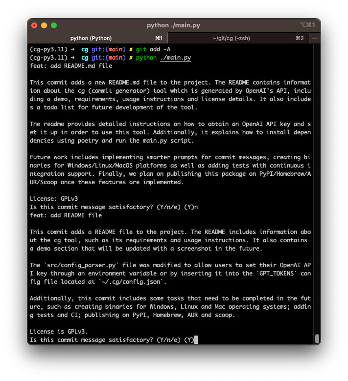

The cg (commit generator) tool which is generated by OpenAI's API.
==================================================

## Demo:


## Requirements:
- Python 3.10+
- poetry
- OpenAI API key

### The OpenAI API key:
You can get the OpenAI API key from [here](https://beta.openai.com/).

Our python code in src/config_parser.py:
```python=
GPT_TOKENS = tuple(os.environ.get('GPT_TOKENS', '').replace(
    ';', ',').replace(':', ',').split(','))
```
So, you can set the environment variable `GPT_TOKENS` to your OpenAI API keys.
Or you could just insert your API key to the `GPT_TOKENS` config file (~/.cg/config.json).

## Usage:
### Download the binary from the latest release:

Linux:
```bash
./cg.elf
```
> Before we publish this tool to the package manager, you could use this command to link the binary to `/usr/local/bin/cg`:
> ```bash
> sudo ln -s ./cg.elf /usr/local/bin/cg
> ```

Mac:
```bash
./cg.macho
```

Windows:
```powershell
.\cg.exe
```

### Using the raw python code:
```bash
$ poetry install
$ poetry run python ./main.py
```

## Todo:
- [ ] Benchmark with other famous commit message generator
- [x] Smarter prompt for commit message
  - [x] Use score to measure the quality of the commit message
- [x] Binary for Windows, Linux, and Mac
- [x] Tests and CI
- [ ] Publish to PyPI, Homebrew, AUR, and scoop

## Known issues:

1. Nuitka building binary failed:
```shell
$ python -m nuitka --onefile --standalone  ./main.py -o cg

Nuitka-Options:INFO: Used command line options: --onefile --standalone ./main.py -o cg
Nuitka:INFO: Starting Python compilation with Nuitka '1.6.3' on Python '3.11' commercial grade 'not installed'.
Nuitka-Plugins:WARNING: anti-bloat: Undesirable import of 'unittest' in 'git.util' (at '/Users/yangzhixuan/git/cg/.venv/lib/python3.11/site-packages/git/util.py:175') encountered. It may slow down
Nuitka-Plugins:WARNING: compilation.
Nuitka-Plugins:WARNING:     Complex topic! More information can be found at https://nuitka.net/info/unwanted-module.html
Nuitka-Plugins:INFO: multiprocessing: Injecting pre-module load code for module 'multiprocessing':
Nuitka-Plugins:INFO: multiprocessing:     Monkey patching "multiprocessing" load environment.
Nuitka-Plugins:INFO: multiprocessing: Injecting post-module load code for module 'multiprocessing':
Nuitka-Plugins:INFO: multiprocessing:     Monkey patching "multiprocessing" for compiled methods.
Nuitka:INFO: Completed Python level compilation and optimization.
Nuitka:INFO: Generating source code for C backend compiler.
Nuitka:INFO: Running data composer tool for optimal constant value handling.
Nuitka:INFO: Running C compilation via Scons.
Nuitka-Scons:INFO: Backend C compiler: clang (clang).
In file included from static_src/CompiledFunctionType.c:2864:
In file included from /Users/yangzhixuan/git/cg/.venv/lib/python3.11/site-packages/nuitka/build/static_src/CompiledCodeHelpers.c:70:
/Users/yangzhixuan/git/cg/.venv/lib/python3.11/site-packages/nuitka/build/static_src/HelpersFilesystemPaths.c:40:15: error: call to undeclared function '_NSGetExecutablePath'; ISO C99 and later do not support implicit function declarations [-Wimplicit-function-declaration]
    int res = _NSGetExecutablePath(binary_filename, &bufsize);
              ^
1 error generated.
Nuitka-Scons:INFO: Backend linking program with 137 files (no progress information available for this stage).
scons: *** [static_src/CompiledFunctionType.o] Error 1
```
    - Solution (Hot patch): Add `#include <mach-o/dyld.h>` in to the `HelpersFilesystemPaths.c` file.
    - [name=scc] I will fix this issue in the future, send a pull request to the Nuitka project.

2. It might be timeout sometimes:
```shell
$ cg

Traceback (most recent call last):
  File "/private/var/folders/w0/_tn54h2167bdhk6j_jglllxh0000gn/T/onefile_55983_1686498617_427518/urllib3/connectionpool.py", line 536, in _make_request
  File "/private/var/folders/w0/_tn54h2167bdhk6j_jglllxh0000gn/T/onefile_55983_1686498617_427518/urllib3/connection.py", line 454, in getresponse
  File "/private/var/folders/w0/_tn54h2167bdhk6j_jglllxh0000gn/T/onefile_55983_1686498617_427518/http/client.py", line 1375, in getresponse
  File "/private/var/folders/w0/_tn54h2167bdhk6j_jglllxh0000gn/T/onefile_55983_1686498617_427518/http/client.py", line 318, in begin
  File "/private/var/folders/w0/_tn54h2167bdhk6j_jglllxh0000gn/T/onefile_55983_1686498617_427518/http/client.py", line 279, in _read_status
  File "/private/var/folders/w0/_tn54h2167bdhk6j_jglllxh0000gn/T/onefile_55983_1686498617_427518/socket.py", line 706, in readinto
  File "/private/var/folders/w0/_tn54h2167bdhk6j_jglllxh0000gn/T/onefile_55983_1686498617_427518/ssl.py", line 1278, in recv_into
  File "/private/var/folders/w0/_tn54h2167bdhk6j_jglllxh0000gn/T/onefile_55983_1686498617_427518/ssl.py", line 1134, in read
TimeoutError: The read operation timed out

The above exception was the direct cause of the following exception:

Traceback (most recent call last):
  File "/private/var/folders/w0/_tn54h2167bdhk6j_jglllxh0000gn/T/onefile_55983_1686498617_427518/requests/adapters.py", line 486, in send
  File "/private/var/folders/w0/_tn54h2167bdhk6j_jglllxh0000gn/T/onefile_55983_1686498617_427518/urllib3/connectionpool.py", line 844, in urlopen
  File "/private/var/folders/w0/_tn54h2167bdhk6j_jglllxh0000gn/T/onefile_55983_1686498617_427518/urllib3/util/retry.py", line 470, in increment
  File "/private/var/folders/w0/_tn54h2167bdhk6j_jglllxh0000gn/T/onefile_55983_1686498617_427518/urllib3/util/util.py", line 39, in reraise
  File "/private/var/folders/w0/_tn54h2167bdhk6j_jglllxh0000gn/T/onefile_55983_1686498617_427518/urllib3/connectionpool.py", line 790, in urlopen
  File "/private/var/folders/w0/_tn54h2167bdhk6j_jglllxh0000gn/T/onefile_55983_1686498617_427518/urllib3/connectionpool.py", line 538, in _make_request
  File "/private/var/folders/w0/_tn54h2167bdhk6j_jglllxh0000gn/T/onefile_55983_1686498617_427518/urllib3/connectionpool.py", line 372, in _raise_timeout
urllib3.exceptions.ReadTimeoutError: HTTPSConnectionPool(host='api.openai.com', port=443): Read timed out. (read timeout=20)

During handling of the above exception, another exception occurred:

Traceback (most recent call last):
  File "/private/var/folders/w0/_tn54h2167bdhk6j_jglllxh0000gn/T/onefile_55983_1686498617_427518/main.py", line 98, in <module>
    main()

  File "/private/var/folders/w0/_tn54h2167bdhk6j_jglllxh0000gn/T/onefile_55983_1686498617_427518/main.py", line 88, in main
    commit_message = get_commit_message()

  File "/private/var/folders/w0/_tn54h2167bdhk6j_jglllxh0000gn/T/onefile_55983_1686498617_427518/main.py", line 67, in get_commit_message
    for msg in generate_commit_message(config, CURRENT_PATH):

  File "/private/var/folders/w0/_tn54h2167bdhk6j_jglllxh0000gn/T/onefile_55983_1686498617_427518/src/commit_msg_generator.py", line 191, in generate_commit_message
  File "/private/var/folders/w0/_tn54h2167bdhk6j_jglllxh0000gn/T/onefile_55983_1686498617_427518/src/commit_msg_generator.py", line 97, in get_score
  File "/private/var/folders/w0/_tn54h2167bdhk6j_jglllxh0000gn/T/onefile_55983_1686498617_427518/requests/api.py", line 115, in post
  File "/private/var/folders/w0/_tn54h2167bdhk6j_jglllxh0000gn/T/onefile_55983_1686498617_427518/requests/api.py", line 59, in request
  File "/private/var/folders/w0/_tn54h2167bdhk6j_jglllxh0000gn/T/onefile_55983_1686498617_427518/requests/sessions.py", line 589, in request
  File "/private/var/folders/w0/_tn54h2167bdhk6j_jglllxh0000gn/T/onefile_55983_1686498617_427518/requests/sessions.py", line 703, in send
  File "/private/var/folders/w0/_tn54h2167bdhk6j_jglllxh0000gn/T/onefile_55983_1686498617_427518/requests/adapters.py", line 532, in send
requests.exceptions.ReadTimeout: HTTPSConnectionPool(host='api.openai.com', port=443): Read timed out. (read timeout=20)
```
    - Solution: You might need to **retry it** in a few time. If it still doesn't work, you can try to increase the timeout value in `src/commit_msg_generator.py`.

## License:
GPLv3
